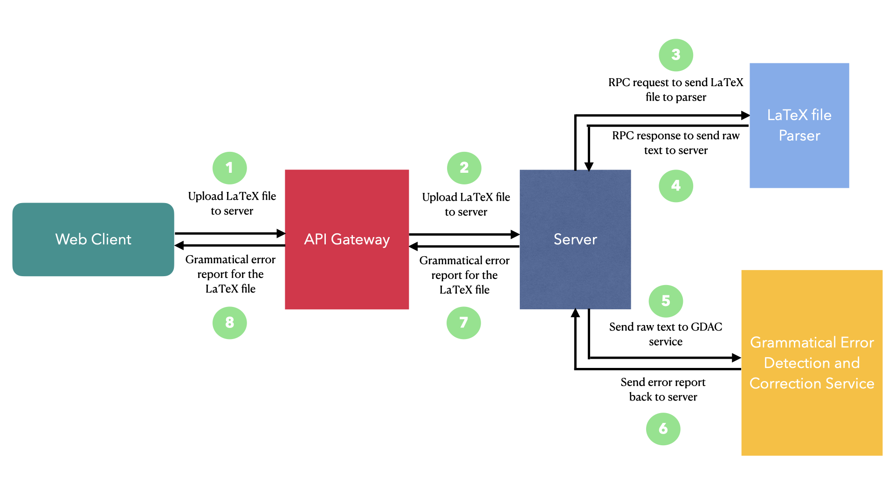
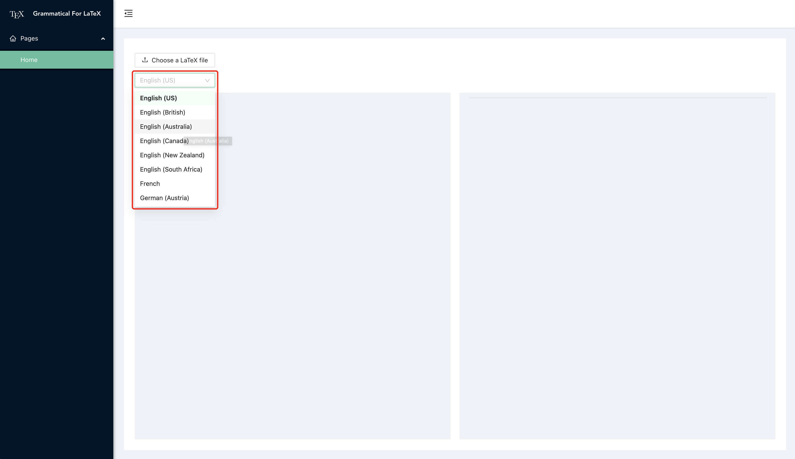
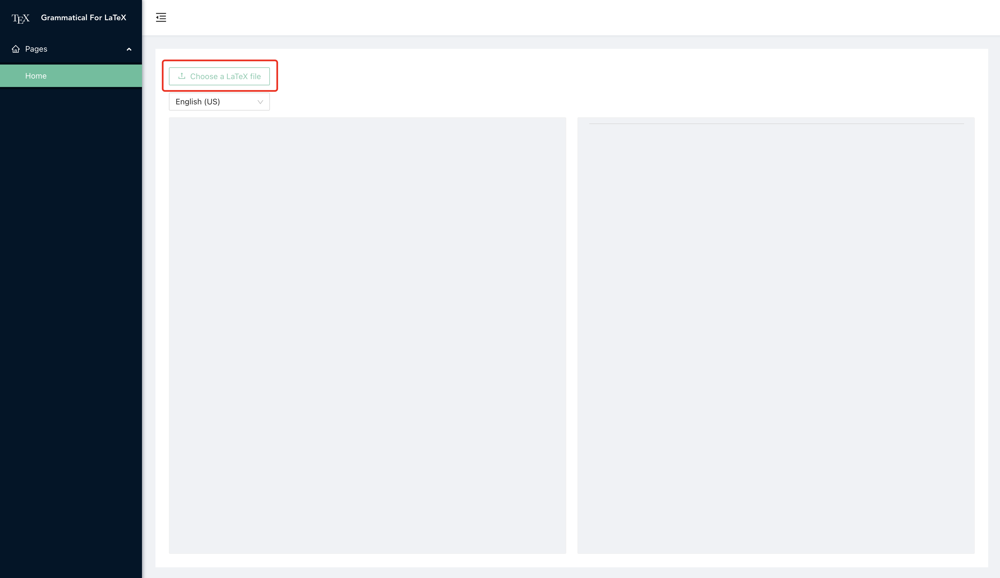
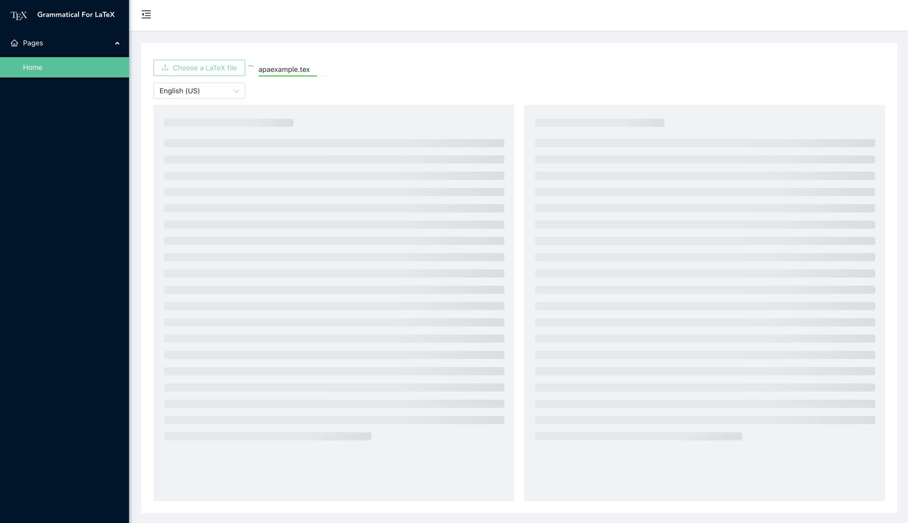
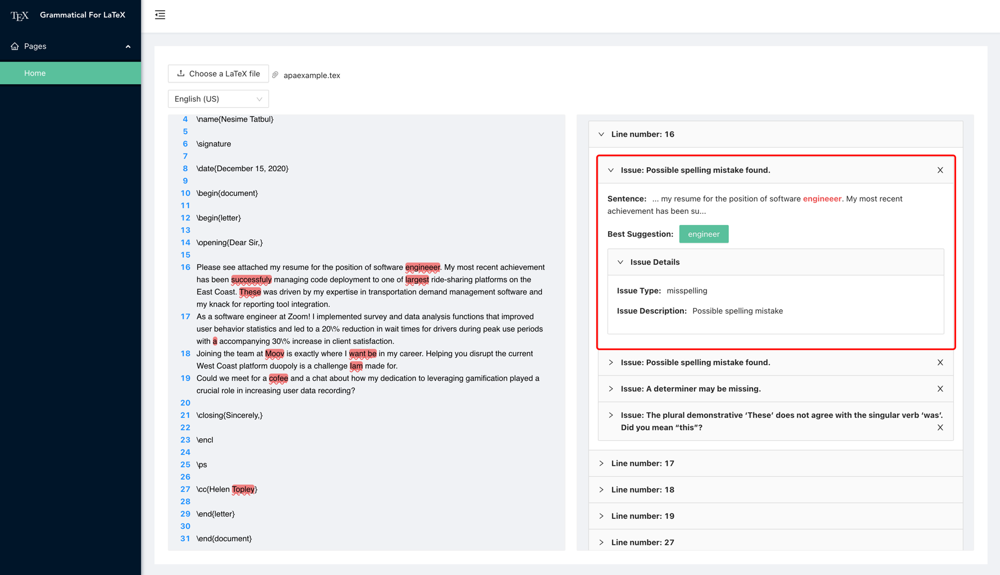
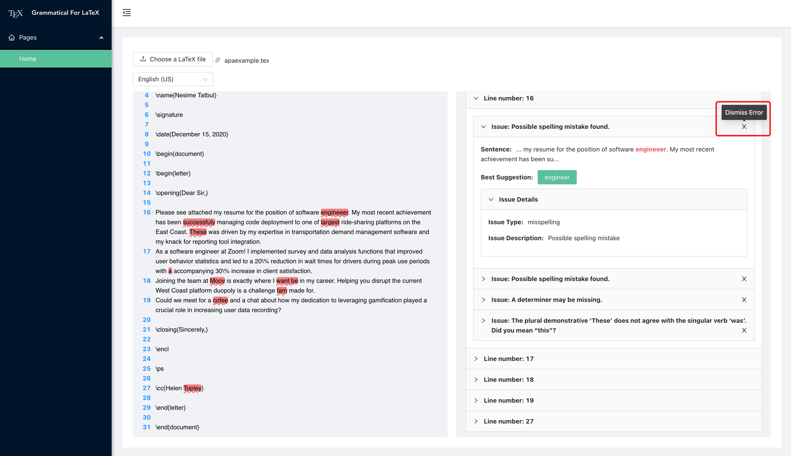
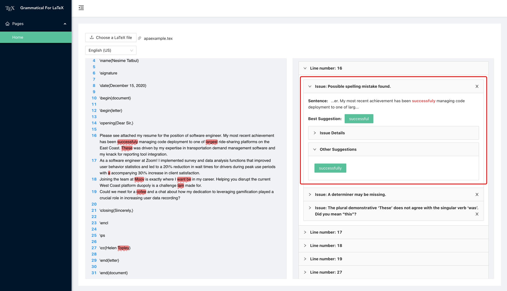
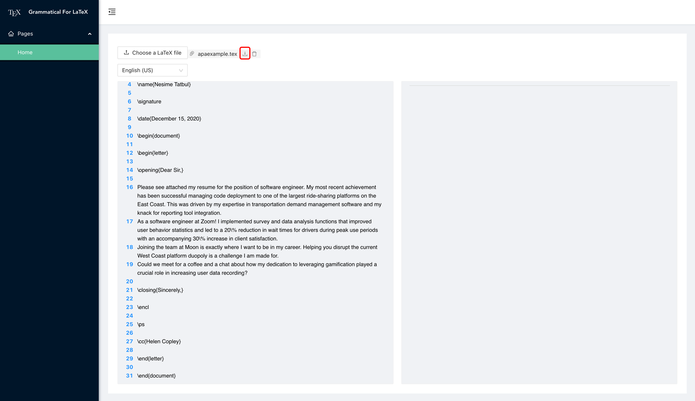

<div align="center">
<h1>Error Correction Tool for LaTeX</h1>
</div>
<div align="center">

[][cd-url]


A grammatical error correction tool for LaTeX files.

More details: [Project Report](https://docs.google.com/document/d/1u2J5UHU7f1RsG-D9Ykhq01e1rKYj4a9W/edit)

Official site: https://correctlatex.xyz
</div>

[cd-url]: https://github.com/uoa-compsci-399/error-correction-tool-for-latex/actions/workflows/cd.yml
<br>
<hr>
<!-- START doctoc generated TOC please keep comment here to allow auto update -->
<!-- DON'T EDIT THIS SECTION, INSTEAD RE-RUN doctoc TO UPDATE -->

- [Official Website](#official-website)
- [Project Architecture & Technologies](#project-architecture--technologies)
- [Instructions](#instructions)
  - [Deploy the project locally](#deploy-the-project-locally)
    - [Step One: Clone the project](#step-one-clone-the-project)
    - [Step Two: Boot the web server service](#step-two-boot-the-web-server-service)
    - [Step Three: Boot the Grammatical Error Detection and Correction service](#step-three-boot-the-grammatical-error-detection-and-correction-service)
    - [Step Four: Boot the LaTeX file parser service](#step-four-boot-the-latex-file-parser-service)
    - [Step Five: Boot the Web client service](#step-five-boot-the-web-client-service)
- [Usages](#usages)
- [Future Plan](#future-plan)
- [Acknowledgements](#acknowledgements)

<!-- END doctoc generated TOC please keep comment here to allow auto update -->
<hr>

## Official Website
https://correctlatex.xyz

## Project Architecture & Technologies


Web client service: [Angular](https://angular.io/) and [Ant Design](https://ng.ant.design/docs/introduce/en)

API gateway service: [Nginx](http://nginx.org/)

Server: [Golang](https://golang.org/) and [gRPC](https://grpc.io/)

LaTeX parser service: [Python](https://www.python.org/), [TexSoup](https://github.com/alvinwan/TexSoup), and [gRPC](https://grpc.io/)

Grammatical Error Detection and Correction service: [LanguageTool](https://github.com/languagetool-org/languagetool) and [Golang](https://golang.org/)

## Instructions
We have an official website https://correctlatex.xyz

If you still want to deploy the project locally (not recommend), following the steps.

### Deploy the project locally
> Make sure [Golang](https://golang.org/dl/), [Python3](https://www.python.org/downloads/), [LanguageTool](https://github.com/languagetool-org/languagetool) and [NodeJS](https://nodejs.org/en/download/) have been installed on your machine.

#### Step One: Clone the project
```shell
git clone https://github.com/uoa-compsci-399/error-correction-tool-for-latex.git
cd error-correction-tool-for-latex
```

#### Step Two: Boot the web server service
1. Build the web server service
    ```shell
    go build -o texcheck
    ./texcheck serve
    ```
   If the service starts successfully, then you will see some output like this:
   ```shell
   INFO[2021-06-03 21:10:15] Error-Correction of LaTeX files Web server starts successfully... 
   INFO[2021-06-03 21:10:15] Listening on port 10399...                   
   INFO[2021-06-03 21:10:15] POST	http://127.0.0.1:10399/api/upload       
   INFO[2021-06-03 21:10:15] Remote Parser Server URL: 	localhost:50051   
   [GIN-debug] [WARNING] Creating an Engine instance with the Logger and Recovery middleware already attached.
   
   [GIN-debug] [WARNING] Running in "debug" mode. Switch to "release" mode in production.
   - using env:	export GIN_MODE=release
   - using code:	gin.SetMode(gin.ReleaseMode)
   
   [GIN-debug] POST   /api/upload               --> github.com/uoa-compsci-399/error-correction-tool-for-latex/server.uploadHandler (4 handlers)
   [GIN-debug] Listening and serving HTTP on :10399
   ```

#### Step Three: Boot the Grammatical Error Detection and Correction service
Open a new terminal window and run the follow command.
1. Boot Grammatical Error Detection and Correction service
   ```shell
   languagetool-server
   ```
   If the service starts successfully, you will see some output like this:
   ```shell
   2021-06-03 21:34:54 +0800 INFO  org.languagetool.server.DatabaseAccess Not setting up database access, dbDriver is not configured
   2021-06-03 13:34:54 +0000 WARNING: running in HTTP mode, consider running LanguageTool behind a reverse proxy that takes care of encryption (HTTPS)
   2021-06-03 13:34:54 +0000 Setting up thread pool with 10 threads
   2021-06-03 13:34:54 +0000 Starting LanguageTool 5.1.3 (build date: 2020-11-16 14:11, 9ef0a18) server on http://localhost:8081...
   2021-06-03 13:34:54 +0000 Server started
   ```

#### Step Four: Boot the LaTeX file parser service
Open a new terminal window and change the current directory to `error-correction-tool-for-latex`.
1. Install the dependencies
   ```shell
   cd parser-server
   pip3 install -r requirements.txt
   ```
2. Boot the LaTeX file parser service
   ```shell
   python3 parser-server.py
   ```

#### Step Five: Boot the Web client service
Open a new terminal window and change the current directory to `error-correction-tool-for-latex`.
1. Install web client service dependencies and build the web client service
    ```shell
    cd web
    npm install --force
    npm run build
    ```
    If the web client service is built successfully, then you will see some output like the below block.
    ```shell
    web@0.0.0 build
    ng build
   
    ✔ Browser application bundle generation complete.✔ Copying assets complete.
    ✔ Index html generation complete.
   
    Initial Chunk Files       | Names                  |      Size
    vendor.js                 | vendor                 |   6.10 MB
    styles.css                | styles                 | 608.76 kB
    polyfills.js              | polyfills              | 128.79 kB
    main.js                   | main                   |  23.57 kB
    runtime.js                | runtime                |   9.01 kB
   
                              | Initial Total          |   6.85 MB
   
    Lazy Chunk Files          | Names                  |      Size
    pages-home-home-module.js | pages-home-home-module | 447.86 kB
    
    Build at: 2021-06-03T13:16:30.001Z - Hash: be66e566b18d72852d32 - Time: 22640ms
    ```
2. Boot the web client service
   ```shell
   cd  dist/web
   npm start
   ```
   If the web client service starts successfully, then you will see some output like this:
   ```shell
   > web@0.0.0 start
   > ng serve --proxy-config proxy.conf.json
   
   ⠋ Generating browser application bundles...[HPM] Proxy created: /api  ->  http://127.0.0.1:10399
   [HPM] Subscribed to http-proxy events:  [ 'error', 'close' ]
   ✔ Browser application bundle generation complete.
   Initial Chunk Files       | Names                  |      Size
   vendor.js                 | vendor                 |   6.43 MB
   styles.css                | styles                 | 608.76 kB
   polyfills.js              | polyfills              | 128.79 kB
   main.js                   | main                   |  24.75 kB
   runtime.js                | runtime                |   9.01 kB
   
                             | Initial Total          |   7.19 MB
   
   Lazy Chunk Files          | Names                  |      Size
   pages-home-home-module.js | pages-home-home-module | 447.86 kB
   
   Build at: 2021-06-03T13:30:16.021Z - Hash: 5d331fe3d35365951cb8 - Time: 17663ms
   
   ** Angular Live Development Server is listening on localhost:4200, open your browser on http://localhost:4200/ **
   
   
   ✔ Compiled successfully.
   ```
3. Open a web browser, and enter in http://localhost:4200

## Usages
1. Choose language
    
2. Choose a LaTeX file
    
3. Upload the file
   
4. See error details
    
5. Dismiss Error
    
6. See other suggestions
    
7. Download the corrected file
    

## Future Plan
1. Improve the accuracy of the error correction. It works fine right now but very few errors were not detected.

2. Add a dictionary function that allows the users to save some technical words.

3. Multiple files could be a nice to have in the end.

4. Finally, the project would be a fully customized NLP algorithm which will be hard to implement. The algorithm could include a learning module where it analyzes the user's choices and improve it as the user use it more.

## Acknowledgements
We would like to thank COMPSCI 399's lecutuer Asma and TA James for all the supports throughout the whole semester.<br>
We would also like to thank our client Josh for friendly feedbacks during our meeting. 😃

We would also to thank these open source libraries.
- [Angular](https://angular.io/)
- [Ant Design](https://ng.ant.design/docs/introduce/en)
- [gRPC](https://grpc.io/)
- [Golang](https://golang.org/)
- [Nginx](http://nginx.org/)
- [Languagetool](https://github.com/languagetool-org/languagetool)
- [Python](https://www.python.org/)
- [TexSoup](https://github.com/alvinwan/TexSoup)


<br>
<hr>


